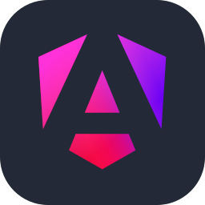
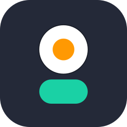

Hey there 👋

As a problem-solver with 7 years in the IT field, I specialize in building end-to-end solutions. My technical toolkit includes Angular, Node.js, NestJS, and a suite of AWS services. I have a proven track record of integrating payment gateways like Stripe and PayPal, leveraging analytics, and building everything from custom libraries to complex microservice-based systems.

## 🌐 Socials:
 
 
 
 
 

## ⚙️ Tools and Technologies:
<table border="0" cellspacing="10" cellpadding="5" width="100%" style="margin: 15px 0px;">
  <tr valign="bottom">
    <!-- Languages -->
    <td align="center">
      <a href="https://developer.mozilla.org/en-US/docs/Web/CSS">
        
         CSS </a>
    </td>
    <td align="center">
      <a href="https://developer.mozilla.org/en-US/docs/Web/HTML">
        
         HTML </a>
    </td>
    <td align="center">
      <a href="https://developer.mozilla.org/en-US/docs/Web/JavaScript">
        
         JavaScript </a>
    </td>
    <td align="center">
      <a href="https://www.python.org">
        
         Python </a>
    </td>
    <td align="center">
      <a href="https://www.typescriptlang.org">
        
         TypeScript </a>
    </td>
    <td align="center">
      
       SVG
    </td>
    <!-- Frontend -->
    <td align="center">
      <a href="https://angular.dev">
        
         Angular </a>
    </td>
    <td align="center">
      
       React
    </td>
  </tr>
  <tr valign="bottom">
    <!-- Frontend (continued) -->
    <td align="center">
      
       Ionic
    </td>
    <td align="center">
      
       Ant Design
    </td>
    <td align="center">
      
       DaisyUI
    </td>
    <td align="center">
      
       DevExpress
    </td>
    <td align="center">
      
       Kendo UI
    </td>
    <td align="center">
      
       Bootstrap
    </td>
    <td align="center">
      
       Tailwind CSS
    </td>
    <td align="center">
      
       jQuery
    </td>
  </tr>
  <tr valign="bottom">
    <!-- Frontend (continued) -->
    <td align="center">
      
       RxJS
    </td>
    <td align="center">
      
       p5.js
    </td>
    <td align="center">
      
       Chart.js
    </td>
    <td align="center">
      
       Three.js
    </td>
    <!-- Backend -->
    <td align="center">
      
       Node.js
    </td>
    <td align="center">
      
       NestJS
    </td>
    <td align="center">
      
       Express
    </td>
    <td align="center">
      
       AutoMapper
    </td>
  </tr>
  <tr valign="bottom">
    <!-- Backend (continued) -->
    <td align="center">
      
       EJS
    </td>
    <td align="center">
      
       FluentValidation
    </td>
    <td align="center">
      
       Nodemon
    </td>
    <td align="center">
      
       Socket.io
    </td>
    <!-- Databases & Caching -->
    <td align="center">
      
       MongoDB
    </td>
    <td align="center">
      
       MySQL
    </td>
    <td align="center">
      
       PostgreSQL
    </td>
    <td align="center">
      
       Sequelize
    </td>
  </tr>
  <tr valign="bottom">
    <!-- Cloud & DevOps (continued) -->
    <td align="center">
      
       Redis
    </td>
    <td align="center">
      
       SQLite
    </td>
    <td align="center">
      
       Supabase
    </td>
    <!-- Cloud & DevOps -->
    <td align="center">
      
       Apache
    </td>
    <td align="center">
      
       AWS
    </td>
    <td align="center">
      
       Azure
    </td>
    <td align="center">
      
       Cloudflare
    </td>
    <td align="center">
      
       Digital Ocean
    </td>
  </tr>
  <tr valign="bottom">
    <td align="center">
      
       Docker
    </td>
    <td align="center">
      
       Firebase
    </td>
    <td align="center">
      
       Netlify
    </td>
    <td align="center">
      
       Nginx
    </td>
    <td align="center">
      
       RabbitMQ
    </td>
    <!-- Cloud & DevOps (continued) -->
    <td align="center">
      
       Sentry
    </td>
    <td align="center">
      
       Vercel
    </td>
    <!-- API & Tools -->
    <td align="center">
      
       GraphQL
    </td>
  </tr>
  <tr valign="bottom">
    <td align="center">
      
       JWT
    </td>
    <td align="center">
      
       Postman
    </td>
    <td align="center">
      
       Redoc
    </td>
    <td align="center">
      
       Swagger
    </td>
    <!-- Version Control -->
    <td align="center">
      
       BitBucket
    </td>
    <td align="center">
      
       Git
    </td>
    <!-- Version Control (continued) -->
    <td align="center">
      
       GitHub
    </td>
    <td align="center">
      
       GitLab
    </td>
  </tr>
  <tr valign="bottom">
    <!-- Build Tools -->
    <td align="center">
      
       npm
    </td>
    <td align="center">
      
       Prettier
    </td>
    <td align="center">
      
       Webpack
    </td>
    <td align="center">
      
       Yarn
    </td>
    <!-- Design & Prototyping -->
    <td align="center">
      
       Adalo
    </td>
    <td align="center">
      
       Blender
    </td>
    <td align="center">
      
       Canva
    </td>
    <td align="center">
      
       CodePen
    </td>
  </tr>
  <tr>
    <!-- Design & Prototyping (continued) -->
    <td align="center">
      
       Figma
    </td>
    <td align="center">
      
       Invision
    </td>
    <td align="center">
      
       Photopea
    </td>
    <!-- Software & Project Management -->
    <td align="center">
      
       Jira
    </td>
    <td align="center">
      
       Sublime Text
    </td>
    <td align="center">
      
       VS Code
    </td>
    <td align="center">
      
       Web3
    </td>
  </tr>
</table>

## 📊 Stats:
 
 

## 🏆 Achievements

<!-- 
### 🔝 Top Contributed Repo
 -->
