[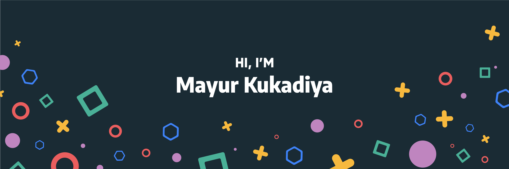](https://mayur-kukadiya.lovable.app)

Hey there 👋

As a problem-solver with 7 years in the IT field, I specialize in building end-to-end solutions. My technical toolkit includes Angular, Node.js, NestJS, and a suite of AWS services. I have a proven track record of integrating payment gateways like Stripe and PayPal, leveraging analytics, and building everything from custom libraries to complex microservice-based systems.

## 🌐 Socials:
 
 
 
 
 

## ⚙️ Tools and Technologies:

<table class="tech-table" border="1">
  <!-- Icons are sorted by category and flow across the grid -->
  <tr>
    <!-- Languages -->
    <td></td>
    <td></td>
    <td></td>
    <td></td>
    <td></td>
    <td></td>
    <!-- Frontend -->
    <td></td>
    <td></td>
    <td></td>
  </tr>
  <tr>
    <!-- Frontend (continued) -->
    <td>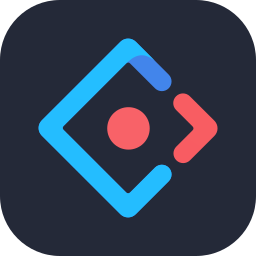</td>
    <td></td>
    <td></td>
    <td></td>
    <td>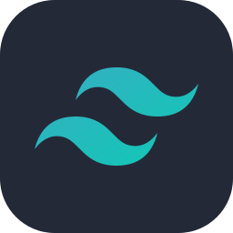</td>
    <td></td>
    <td>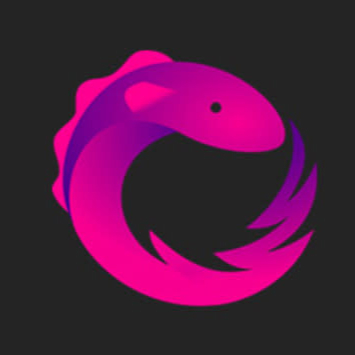</td>
    <td></td>
  </tr>
  <tr>
    <!-- Frontend (continued) -->
    <td>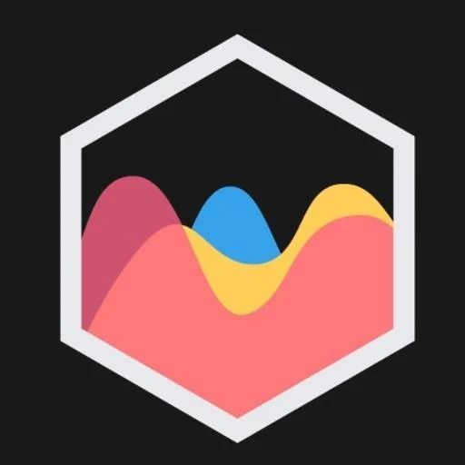</td>
    <td>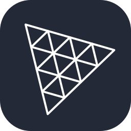</td>
    <!-- Backend -->
    <td></td>
    <td>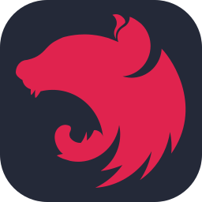</td>
    <td></td>
    <td>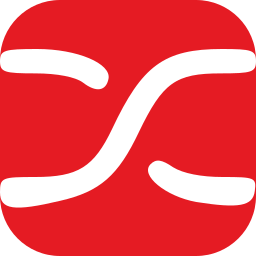</td>
    <td>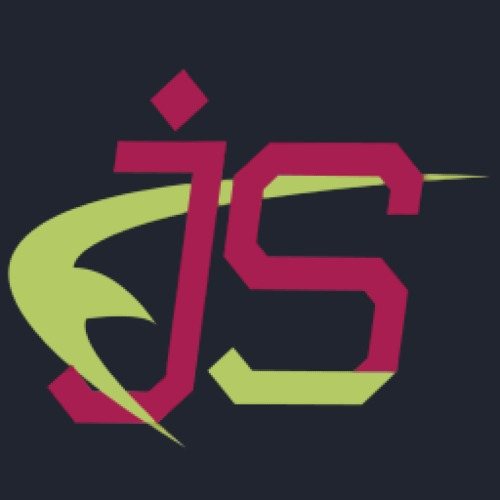</td>
    <td>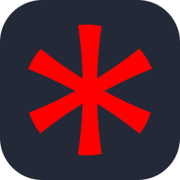</td>
    <td>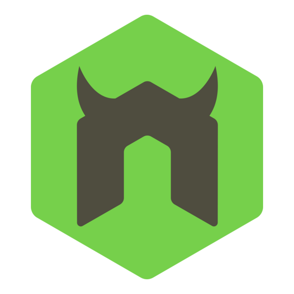</td>
  </tr>
  <tr>
    <!-- Backend (continued) -->
    <td>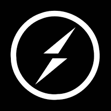</td>
    <!-- Databases & Caching -->
    <td></td>
    <td></td>
    <td></td>
    <td>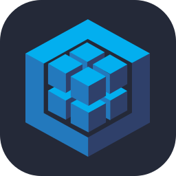</td>
    <td></td>
    <td></td>
    <td></td>
    <!-- Cloud & DevOps -->
    <td></td>
  </tr>
  <tr>
    <!-- Cloud & DevOps (continued) -->
    <td></td>
    <td></td>
    <td></td>
    <td>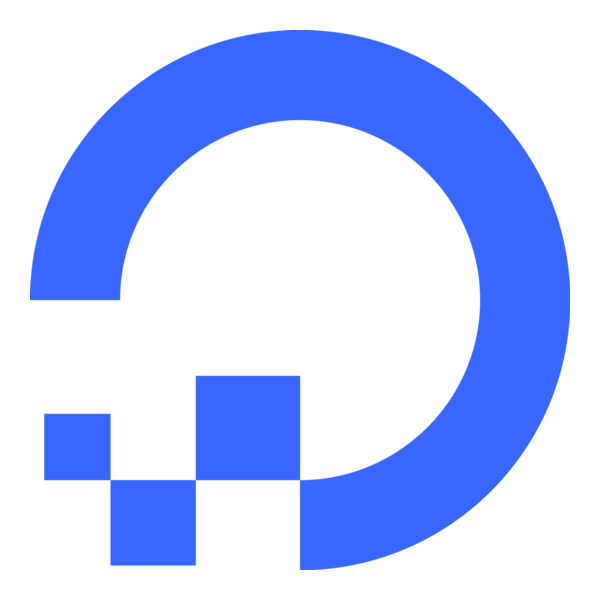</td>
    <td></td>
    <td></td>
    <td></td>
    <td></td>
    <td></td>
  </tr>
  <tr>
    <!-- Cloud & DevOps (continued) -->
    <td></td>
    <td>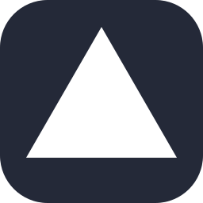</td>
    <!-- API & Tools -->
    <td></td>
    <td>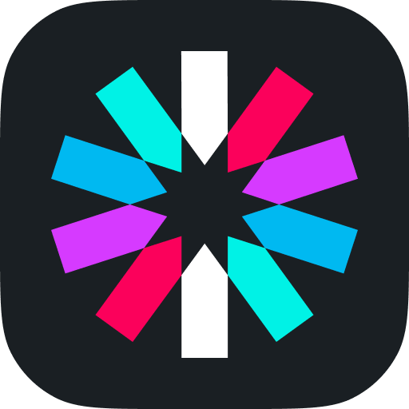</td>
    <td></td>
    <td>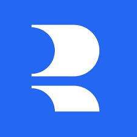</td>
    <td>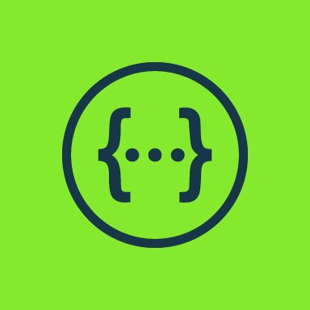</td>
    <!-- Version Control -->
    <td>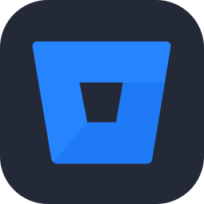</td>
    <td></td>
  </tr>
  <tr>
    <!-- Version Control (continued) -->
    <td></td>
    <td>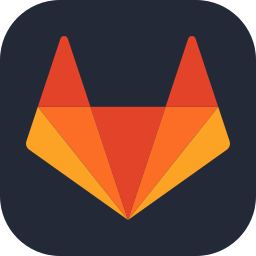</td>
    <!-- Build Tools -->
    <td>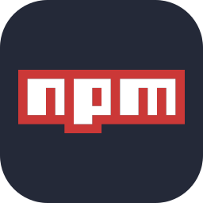</td>
    <td></td>
    <td></td>
    <td></td>
    <!-- Design & Prototyping -->
    <td>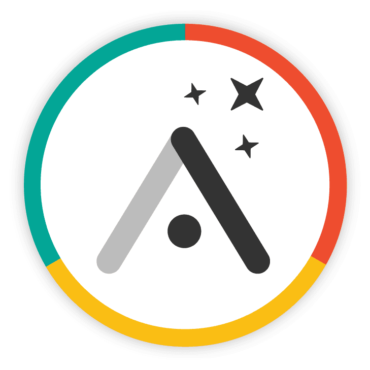</td>
    <td></td>
    <td></td>
  </tr>
  <tr>
    <!-- Design & Prototyping (continued) -->
    <td>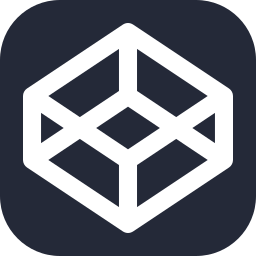</td>
    <td></td>
    <td></td>
    <td></td>
    <!-- Software & Project Management -->
    <td></td>
    <td>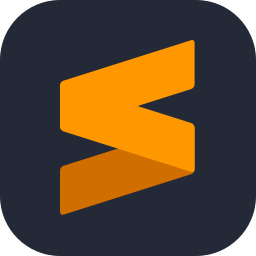</td>
    <td></td>
    <td>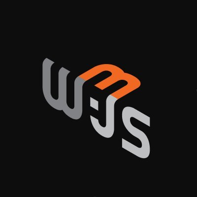</td>
    <td></td> <!-- Empty cell to fill the row -->
  </tr>
</table>

## 📊 Stats:
 
 

## 🏆 Achievements

<!-- 
### 🔝 Top Contributed Repo
 -->
